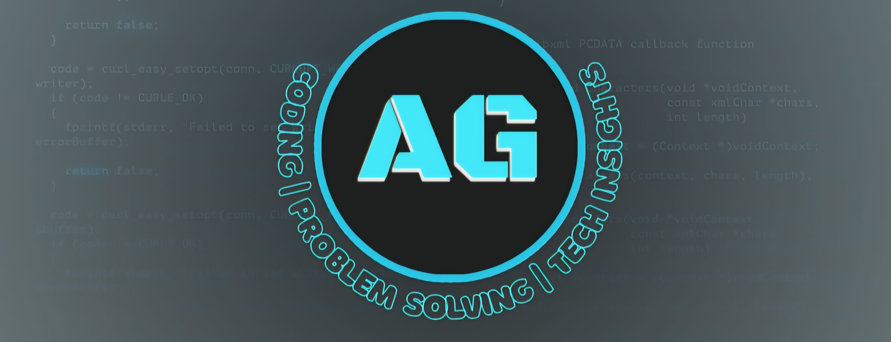

<h1 align="center">Hey there 👋 I'm Abdulrhman Goda</h1>

<h3 align="center">
Software Engineer | Backend-Focused
</h3>

I build scalable, maintainable, and user-focused web applications.

---

## 👨‍💻 About Me

I'm a **dedicated Software Engineer** with a strong interest in **backend development and system design**.  
I enjoy turning complex problems into clean, efficient, and reliable solutions.

- 🎓 **B.Sc. in Software Engineering** — Modern Academy for Engineering & Technology (Maadi), Aug 2024  
- 🚀 Continuously improving my skills to become a **professional software engineer**
- 🧠 Strong believer in **clean code, good architecture, and continuous learning**
- ☕ I learn by building, breaking, and rebuilding things

> *“Code quality is not optional — it’s a responsibility.”*

---

## 🔗 Portfolio & Contact

- 🌐 **Portfolio:** https://abdogoda.github.io/AG  
- 📩 **Email:** abdogoda0a@gmail.com  

---

  
  
  
  

  

---

## 🚀 I code with

  
  
  
  
  
  
  
  
  
  
  
  
  
  
  
  
  
  
  
  
  
  
  
  
  
  
  
  
  
  
  
  
  
  
  
  
  
  
  
  
  

###

  

###
